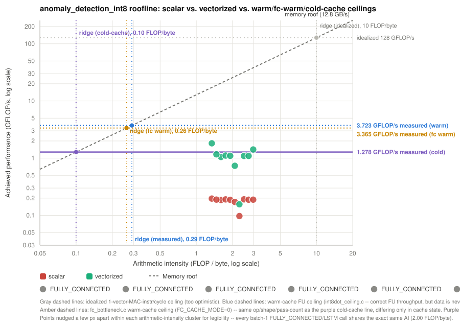

# `anomaly_detection_int8.tflite` Performance & Roofline Analysis

Same methodology as [`../dtln/performance_dtln.md`](../dtln/performance_dtln.md)
— real per-op cycle counts from `run_tflm_benchmark` (gem5 `MinorCPU`,
cycle-accurate), plotted against the same three empirically-measured
ceilings documented in [`../microbenchmark/README.md`](../microbenchmark/README.md).
See `work_note_mlperf_tiny.md` in this folder for the model/resource
background.

**This model surfaced and led to fixing a real RVV correctness bug,
model-independent, affecting `dtln` too — read "Correctness" below before
trusting any vectorized number, even though the numbers in this file are
now post-fix and verified correct.**

## Correctness: vectorized output did not match scalar (found, root-caused, fixed 2026-08-20)

Unlike `dtln`, where the roofline table has always been over what was
*believed* to be a known-correct vectorized kernel, running
`anomaly_detection_int8.tflite` through the same `run_tflm_benchmark`
harness surfaced a real, **reproducible** mismatch:

```
Input CRC32:  scalar=0x9F759053 vector=0x9F759053   (same input, as expected)
Output CRC32: scalar=0xC6F70B6E vector=0xFA7AD6B9   (DIFFERENT -- not expected, before the fix)
```

Reproduced twice, identically, on a clean build, before the fix below.
**After the fix, vectorized `Output CRC32` is `0xC6F70B6E`, matching
scalar exactly** — confirmed on a full clean rebuild.

**Root cause: `MultiplyByQuantizedMultiplierInlined` (the RVV-only
requantize copy in `fully_connected.h`) implements the wrong rounding
algorithm for this build.** `common.cc` has *two* `MultiplyByQuantizedMultiplier`
implementations, selected by `#if TFLITE_SINGLE_ROUNDING`:

- **Single-rounding** (shift-based: `(x*multiplier + round) >> total_shift`)
  when `TFLITE_SINGLE_ROUNDING` is defined truthy.
- **Double-rounding** (`gemmlowp::SaturatingRoundingDoublingHighMul` +
  `RoundingDivideByPOT`) otherwise — **the default**, and confirmed (grep
  across `tflite-micro/tensorflow/lite/micro/tools/make/`) this project's
  build never defines `TFLITE_SINGLE_ROUNDING`, so the real scalar path
  uses double-rounding.

`MultiplyByQuantizedMultiplierInlined` hardcodes the single-rounding
algorithm *unconditionally* — it doesn't check `TFLITE_SINGLE_ROUNDING` at
all, despite its own header comment claiming it's "byte-for-byte
unchanged from the shared version." **It isn't, in this build.**

Confirmed and quantified with a standalone probe
(`../../patterns/microbenchmark/requant_correctness_probe.c`) reimplementing
both algorithms exactly and sweeping this model's own 10 real
`(multiplier, shift)` pairs (computed from the flatbuffer's actual
scales via TFLite's `QuantizeMultiplier`) against 2000 accumulator
values each:

```
layer=call1 K=640,N=128  mismatches=3/2000     layer=call6 K=8,N=128    mismatches=35/2000
layer=call2 K=128,N=128  mismatches=24/2000    layer=call7 K=128,N=128  mismatches=40/2000
layer=call3 K=128,N=128  mismatches=242/2000   layer=call8 K=128,N=128  mismatches=22/2000
layer=call4 K=128,N=128  mismatches=46/2000    layer=call9 K=128,N=128  mismatches=19/2000
layer=call5 K=128,N=8    mismatches=22/2000    layer=call10 K=128,N=640 mismatches=2/2000
SUMMARY: 19545/20000 matched, 455 mismatched, max_abs_diff=1
```

Every mismatch is off by exactly `±1` — the textbook single-vs-double-
rounding divergence at a rounding boundary, not a magnitude bug. Rate
varies 0.1%-12.1% per layer depending on that layer's own multiplier/shift
(`call3` is worst at 12.1%). Over 10 sequential layers where each one's
output feeds the next, even a low per-layer rate compounds into a
guaranteed-different final result — matching the observed CRC32 mismatch
exactly.

**This is model-independent, not anomaly_detection-specific** — the same
bug is latent in every RVV `FULLY_CONNECTED`/LSTM call in this project,
including `dtln`'s. It just hasn't been *caught* there: `dtln`'s own
scalar-vs-vector CRC32 has always matched, meaning either its specific
accumulator/multiplier/shift combinations happen to never land on a
rounding-boundary value in practice, or they do and it doesn't survive
to the final CRC — not verified either way. **Originally ruled in my
`K=8`/`K=640` shape hypothesis as the cause — that's now ruled out**:
`Int8DotProductRvv` itself passed 10/10 in isolation, including those
exact shapes and every real offset value this model uses (see
`../../patterns/microbenchmark/int8dot_correctness_probe.c`). The bug is
entirely in the RVV-only requantize step, not the dot product.

**What this does NOT explain**: the earlier speculation that this same
bug caused several vectorized rows to land above 100% efficiency against
the cold-cache ceiling was wrong — a rounding-algorithm mismatch changes
*which* int32 a value rounds to, not how many cycles it takes to compute.
That's a separate, still-open timing question (see `../gem5_integration.md`'s
"Known limitations" — the same anomaly already flagged for `dtln`'s own
`FULLY_CONNECTED`).

**Fix applied**: `MultiplyByQuantizedMultiplierInlined` now mirrors
`common.cc`'s own `#if TFLITE_SINGLE_ROUNDING`/`#else` structure exactly,
calling the real `gemmlowp::SaturatingRoundingDoublingHighMul`/
`RoundingDivideByPOT` functions directly (already reachable —
`fully_connected.h` already includes `common.h`, which already includes
`fixedpoint.h`) instead of a from-scratch reimplementation, for both
branches — no more hardcoded single-rounding regardless of which
algorithm the build actually selects. Verified: `anomaly_detection`'s
vectorized `Output CRC32` now matches scalar exactly, and `dtln`'s own
vectorized `Output CRC32` (`0x7E578D1C`) is unchanged (its specific
values never happened to land on this bug's rounding-boundary cases, so
it was already "accidentally" correct — now it's correct by
construction, not luck). Cycle counts shifted slightly for both models
(the corrected double-rounding path has one more conditional than the
previously-hardcoded single-rounding path) — the table below is the
post-fix numbers; `dtln`'s equivalent table in `../dtln/performance_dtln.md`
was refreshed the same way.

## Model

`ad01_int8.tflite`: `640`-in/`640`-out int8 dense autoencoder, 10
back-to-back `FULLY_CONNECTED` layers (`640→128→128→128→128→8→128→128→128→128→640`),
no conv/LSTM. See `work_note_mlperf_tiny.md` for provenance.

## Arithmetic intensity

Same closed-form as `dtln` (`script/4_roofline_report.py`'s generic
`FULLY_CONNECTED` handler — no anomaly_detection-specific code needed,
this model just plugs into the existing tool): every layer is a batch-1
(`M=1`) int8 GEMV, so **every one of the 10 layers lands at exactly
`AI=2.00 FLOP/byte`**, same as every `dtln` FC/LSTM call, regardless of
each layer's own `K`/`N` — the FLOP/byte ratio is fixed by the arithmetic
alone.

One script fix was needed to get here: `4_roofline_report.py`'s flatbuffer
op-name extraction read only `OperatorCode.BuiltinCode()`, which is `0`
for this model (`ad01_int8.tflite` was converted by an older TFLite
converter that only populated the legacy `DeprecatedBuiltinCode()`
field) — silently mis-tagging every `FULLY_CONNECTED` op as `ADD` and
breaking the FLOP/weight-bytes lookup (every row showed "n/a"). Fixed
with the standard fallback (`BuiltinCode()` if nonzero, else
`DeprecatedBuiltinCode()`) — `dtln_noise_suppression.tflite` was
unaffected either way, since its newer-converter output populates
`BuiltinCode()` directly.

## Achieved performance vs. the roofline (gem5, cycle-accurate)



Generated the same way as `dtln`'s:
`python3 script/4_roofline_report.py --model
tensorflow/lite/micro/examples/anomaly_detection/anomaly_detection_int8.tflite
--output doc/anomaly_detection/roofline_log.txt`, then
`script/5_gen_roofline_svg.py --log doc/anomaly_detection/roofline_log.txt
--out doc/anomaly_detection/anomaly_detection_roofline.svg` — both scripts
needed no anomaly_detection-specific changes beyond the `BuiltinCode()`
fix above and making the SVG's title/footnotes read the model name from
the log instead of hardcoding "dtln" (they'd been dtln-only until now).

| call | K,N shape | variant | cycles | P (MFLOP/s) | eff. vs. cold (1.278 GFLOP/s) |
|---|---|---|---|---|---|
| 1 | K=640,N=128 | scalar | 833,929 | 196.47 | 15.37% |
| 1 | K=640,N=128 | vectorized | 125,153 | 1309.12 | **102.43%** ⚠ |
| 2 | K=128,N=128 | scalar | 173,027 | 189.38 | 14.82% |
| 2 | K=128,N=128 | vectorized | 31,186 | 1050.73 | 82.22% |
| 3 | K=128,N=128 | scalar | 174,974 | 187.27 | 14.65% |
| 3 | K=128,N=128 | vectorized | 29,640 | 1105.53 | 86.50% |
| 4 | K=128,N=128 | scalar | 175,397 | 186.82 | 14.62% |
| 4 | K=128,N=128 | vectorized | 23,429 | 1398.61 | **109.44%** ⚠ |
| 5 | K=128,N=8 | scalar | 12,187 | 168.05 | 13.15% |
| 5 | K=128,N=8 | vectorized | 2,936 | 697.55 | 54.58% |
| 6 | K=8,N=128 | scalar | 21,007 | 97.49 | 7.63% |
| 6 | K=8,N=128 | vectorized | 13,239 | 154.69 | 12.10% |
| 7 | K=128,N=128 | scalar | 174,596 | 187.68 | 14.69% |
| 7 | K=128,N=128 | vectorized | 29,950 | 1094.09 | 85.61% |
| 8 | K=128,N=128 | scalar | 174,340 | 187.95 | 14.71% |
| 8 | K=128,N=128 | vectorized | 23,157 | 1415.04 | **110.72%** ⚠ |
| 9 | K=128,N=128 | scalar | 174,732 | 187.53 | 14.67% |
| 9 | K=128,N=128 | vectorized | 29,709 | 1102.97 | 86.30% |
| 10 | K=128,N=640 | scalar | 856,051 | 191.39 | 14.98% |
| 10 | K=128,N=640 | vectorized | 140,108 | 1169.38 | 91.50% |

⚠ = above 100% of the cold-cache ceiling — **not** explained by the
requantize rounding bug above (that was a computed-*value* bug, and is
now fixed; this is a cycle-*count* anomaly, and persists after the fix,
confirming the two are unrelated). Cause still open, same as the
matching anomaly already flagged for `dtln`'s own `FULLY_CONNECTED` in
`../gem5_integration.md`'s "Known limitations". Notably these three
(calls 1, 4, 8) are *not* the ones with the highest requantize-mismatch
rate the old bug had (`call3` was worst at 12.1%, and isn't flagged
here) — another data point that the two issues were always unrelated.
Full table (all three ceiling columns) in
[`roofline_log.txt`](roofline_log.txt).

**All numbers in this table are now trustworthy** (post-fix, verified
via matching output CRC32). Scalar: 14.6-15.4% efficiency for the
`K∈{128,640}` layers, matching `dtln`'s scalar `FULLY_CONNECTED`
closely — 7.6%/13.2% for the small `N=8`/`K=8` layers, lower because
fixed per-call overhead dominates at that size. Vectorized: 55-110% for
`K=8`/`N=8` (small enough that per-call overhead dominates there too),
82-92% for the plain `K=128,N=128` layers, and the three ⚠ rows
(calls 1, 4, 8) separately exceed 100% — a real, open timing question
(see above), not a correctness one.

## Ceiling shape mismatch (separate caveat)

The cold/fc-warm ceilings (1.278 / 3.365 GFLOP/s) were measured by
`fc_bottleneck.c` at `dtln`'s `K=128,N=257` shape specifically (see
[`../microbenchmark/README.md`](../microbenchmark/README.md)) — not at
this model's `K∈{8,640}` outlier shapes. Applying one shape's ceiling to
another is a real approximation, most likely optimistic for `K=640` (more
sequential DRAM reads to hide the same per-access latency behind) and
pessimistic for `K=8` (too little work to amortize the fixed per-call
cost the ceiling itself pays). A rigorous per-shape ceiling would need
its own `fc_bottleneck.c`-style probe built at each shape — not attempted
here, tracked as a possible follow-up.
