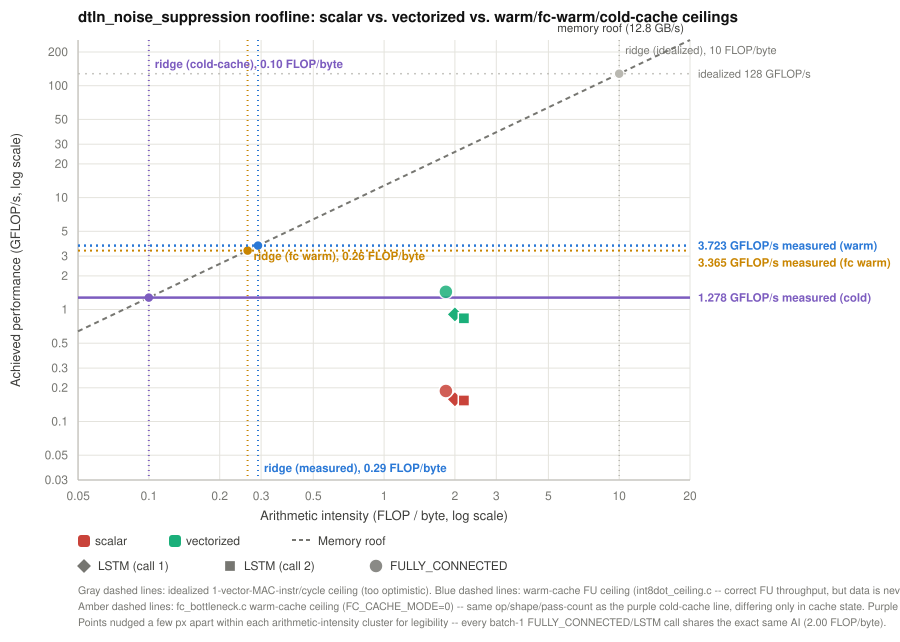

# `dtln_noise_suppression.tflite` Performance & Roofline Analysis

## Table of contents

- [Per-op cycle counts: `dtln_noise_suppression.tflite` on `riscv64_baremetal`](#per-op-cycle-counts-dtln_noise_suppressiontflite-on-riscv64_baremetal)
- [Vectorized `FULLY_CONNECTED` and LSTM (`riscv64_baremetal_vector`) vs. scalar baseline](#vectorized-fully_connected-and-lstm-riscv64_baremetal_vector-vs-scalar-baseline)
- [Roofline analysis](#roofline-analysis)
  - [Machine parameters](#machine-parameters)
  - [Microbenchmark build settings](#microbenchmark-build-settings)
  - [Arithmetic intensity](#arithmetic-intensity)
  - [Achieved performance vs. the roofline (gem5, cycle-accurate)](#achieved-performance-vs-the-roofline-gem5-cycle-accurate)
- [Benchmark candidate comparison (FC/Conv layer shapes)](#benchmark-candidate-comparison-fcconv-layer-shapes)
- [Reproducing](#reproducing)

Deep-dive performance analysis for `dtln_noise_suppression.tflite`, split
out of [`performance.md`](../performance.md) (which stays the consolidated
whole-run log across every benchmark in this project — `dtln_test` is just
one row there). This file covers everything specific to `dtln`: real
per-op cycle counts, the vectorized `FULLY_CONNECTED` **and** LSTM kernels
(both `int8` gate matmuls now take the RVV fast path — see below), the
roofline analysis built on top of it, and why `dtln_noise_suppression` was
picked as the standing benchmark target in the first place.

**Toolchain: GCC 13.4.0-1** (`1_toolchain/xpack/xpack-riscv-none-elf-gcc-13.4.0-1/`),
the project default as of the LSTM vectorization fix below — GCC 13.2.0-2
(the previous default, still installed alongside it) miscompiles the fixed
`Int8DotProductRvv` at `-O2`. See "LSTM vectorization" in
[`gem5_integration.md`](../gem5_integration.md) for the full story.

**Same caveat as `performance.md`'s intro applies:** TFLM's per-op software
timing instrumentation isn't wired up by default — every op prints `0
ticks (0 ms)` unless both (a) a profiler is explicitly passed into
`MicroInterpreter` (only `run_tflm_benchmark` does this; `dtln_test`
doesn't) and (b) the target has its own `micro_time.cc` reading a real
cycle counter (`riscv64_baremetal`/`riscv64_baremetal_vector` both do).
Every number in this file comes from `run_tflm_benchmark`, not `dtln_test`
directly — see the callout in "Vectorized `FULLY_CONNECTED`" below for why.

## Per-op cycle counts: `dtln_noise_suppression.tflite` on `riscv64_baremetal`

Real per-op profiling, not `0 ticks` — see "Per-op cycle counts on
`riscv64_baremetal`" in [`gem5_integration.md`](../gem5_integration.md) for
how (`micro_time.cc` reading `mcycle`, plus running via
`run_tflm_benchmark` instead of `dtln_test` directly, since only the
former wires a `MicroProfiler`). `GENERIC_BENCHMARK_ARENA_SIZE=16384`.

| Op | gem5 cycles | whisper cycles |
|---|---|---|
| `UNIDIRECTIONAL_SEQUENCE_LSTM` (1st call) | 2,685,618 | 2,479,287 |
| `UNIDIRECTIONAL_SEQUENCE_LSTM` (2nd call) | 1,845,791 | 1,688,145 |
| `FULLY_CONNECTED` | 378,379 | 311,697 |
| `LOGISTIC` | 89,537 | 88,405 |
| **Total (profiled ops only)** | **4,999,325** | **4,567,534** |

Output CRC32 (`0x7E578D1C`) identical between simulators. gem5's numbers
are the trustworthy ones for actual performance comparison (models real
pipeline stalls); whisper's are close but not cycle-accurate (functional
simulator, closer to an idealized-IPC assumption) — good for fast relative
comparison, not absolute numbers.

**The LSTM, not the `FULLY_CONNECTED` layer, dominates** — ~91% of total
profiled cycles either way. Relevant if/when comparing a vectorized
`FULLY_CONNECTED` kernel against this baseline: the FC layer alone is a
small fraction of this model's total cost.

`person_detect.tflite` hasn't been run through this same per-op profiling
path yet — deliberately skipped given its ~7–9 minute gem5 wall-clock cost.

## Vectorized `FULLY_CONNECTED` and LSTM (`riscv64_baremetal_vector`) vs. scalar baseline

See "A vectorized `FULLY_CONNECTED` kernel" and "LSTM vectorization" in
[`gem5_integration.md`](../gem5_integration.md) for the full implementation
history, including two real correctness bugs found/fixed along the way:
(1) an `if constexpr` type guard that didn't check `OutputType`, which let
the fast path incorrectly apply to `lstm_eval.cc`'s internal `int16_t`
gate matmuls before the underlying bug (below) was actually fixed — caught
via an Output CRC32 mismatch, `0x50433D2B` vs. the correct `0x7E578D1C`;
and (2) the *real* bug that guard was masking: `Int8DotProductRvv` folded
`input_offset`/`filter_offset` into a widening-add whose scalar operand is
only 8 bits wide, silently truncating a legal offset value of exactly
`128` (e.g. `zero_point=-128`) — latent in the FC kernel too, just never
triggered by FC's own zero-point (`+4`). Fixed via the standard
gemmlowp-style algebraic expansion (offsets applied via scalar `int32_t`
arithmetic after vector reduction, never passed to a narrow vector
intrinsic). That fix also uncovered a GCC 13.2 `-O2` codegen bug blocking
it from working at all — resolved by upgrading to **GCC 13.4.0-1** (see
above).

| | gem5 (cycle-accurate) | whisper (functional, no timing model) |
|---|---|---|
| Baseline `FULLY_CONNECTED` | 378,379 | 311,697 |
| Vectorized `FULLY_CONNECTED` | 54,858 | 13,316 |
| **Speedup** | **6.90×** | **23.41×** (not representative — see below) |
| Baseline `UNIDIRECTIONAL_SEQUENCE_LSTM` (1st call) | 2,685,618 | 2,479,287 |
| Vectorized `UNIDIRECTIONAL_SEQUENCE_LSTM` (1st call) | 395,600 | 129,001 |
| **Speedup** | **6.79×** | **19.22×** |
| Baseline `UNIDIRECTIONAL_SEQUENCE_LSTM` (2nd call) | 1,845,791 | 1,688,145 |
| Vectorized `UNIDIRECTIONAL_SEQUENCE_LSTM` (2nd call) | 270,328 | 109,182 |
| **Speedup** | **6.83×** | **15.46×** |

Output CRC32 (`0x7E578D1C`) identical to baseline in every case — verified
correct, not just faster; also cross-validated against 3 other
FC/LSTM shapes entirely (`mnist_lstm`'s `trained_lstm_int8` — a genuinely
different LSTM with a 28-timestep sequential call, not just a different
shape; `micro_speech_quantized`'s extreme `K=4000,N=4` FC;
`hello_world_int8`'s tiny `K=16,N=16` FC) — all matched their respective
scalar-target baselines exactly. gem5's ~6.8–6.9× is the number to trust
for each op; whisper's much larger speedups are inflated by having no
cycle-accurate memory/pipeline model (can't capture the real cost of the
vector loads), so don't read them as real-hardware expectations.

These numbers include two further fixes on top of the offset-truncation
one above:

- `Int8DotProductRvv`'s base `LMUL` was widened from `1` to `2` (`e8m2 ->
  e16m4 -> e32m8`, the widest feasible for this double-widening chain)
  after measuring 25-34% fewer cycles at `accum_depth >= 128` on a
  standalone probe — see "`Int8DotProductRvv`: widened from base `LMUL=1`
  to `LMUL=2`" in [`gem5_integration.md`](../gem5_integration.md) for the
  shape-by-shape breakdown (small `accum_depth <= 28` sees a small ~4%
  *regression*, accepted since dtln's own shapes are all `>= 128`).
- `MultiplyByQuantizedMultiplier` (the int32 requantize step) was
  force-inlined on this hot path instead of calling the shared,
  `TFLITE_NOINLINE` version — confirmed via disassembly to be a genuine
  out-of-line `jalr` call, once per output channel, and measured as a
  **29.34% whole-model cycle reduction** on its own (`FULLY_CONNECTED`
  alone: -34.93%), the single largest optimization found in this project.
  See "Realistic FULLY_CONNECTED bottleneck decomposition" in
  [`gem5_integration.md`](../gem5_integration.md) for the full writeup —
  including the standalone-benchmark investigation that led to finding it.

Whole-model effect — now both `FULLY_CONNECTED` **and** the LSTM
(~91% of total cycles) are vectorized:

| | gem5 total ticks | whisper total ticks |
|---|---|---|
| Baseline | 4,999,325 | 4,567,534 |
| With vectorized FC only (historical intermediate step) | 4,369,141 | 4,281,314 |
| With vectorized FC + LSTM (offset fix only) | 1,233,600 | 524,701 |
| With vectorized FC + LSTM (offset fix + `LMUL=2`) | 1,141,199 | 455,304 |
| With vectorized FC + LSTM (+ inlined `MultiplyByQuantizedMultiplier`) | **806,800** | **339,904** |
| **Whole-model speedup (vs. baseline)** | **~6.20×** | **~13.44×** |

Vectorizing FC alone only bought ~12.6% whole-model speedup, since the
LSTM — the actual bulk of the work — was untouched. Vectorizing both, plus
widening `LMUL`, was the win the roofline analysis below originally
predicted was available — and inlining the requantize call turned out to
be a bigger win than either of those on its own, found only after directly
measuring where the vectorized kernel's cycles actually go (see
`gem5_integration.md`).

Target: `riscv64_baremetal_vector` (`-march=rv64imc_zicsr_zve64x`) — a
separate `TARGET` from plain `riscv64_baremetal` deliberately, to avoid
`GENDIR` cache collisions between the two `-march=` variants (this build
has no `.d` header-dependency tracking at all — a real gotcha discovered
along the way, see the doc — so mixing arches under one `TARGET` risks
silently linking stale objects).

> **If you want to do roofline analysis, build/run with
> `TARGET=riscv64_baremetal_vector`, not plain `riscv64_baremetal`.** The
> roofline's peak-compute ceiling below is defined by the RVV vector unit's
> int8 throughput (`VLEN=512`) — only `riscv64_baremetal_vector` binaries
> (`-march=...zve64x`) actually contain RVV instructions. Plain
> `riscv64_baremetal` is pure scalar (`rv64imc_zicsr`, no `v` extension) and
> structurally can't approach that ceiling regardless of optimization, so
> its achieved-performance points aren't meaningful to plot against a
> vector-unit-based peak line. (Concrete illustration of the same fact:
> whisper's `Vector`/`VectorLoad`/`VectorStore` HPM counters read 0 on the
> scalar target — there are no RVV instructions to count at all.)
>
> **Also run `run_tflm_benchmark`, not `test_dtln_test`, as the binary.**
> `dtln_test.cc` constructs `MicroInterpreter` without a `MicroProfiler`
> (see the caveat at the top of this file), so it never calls
> `GetCurrentTimeTicks()` and its log has no per-op cycle counts at all —
> only whole-run pass/fail. `run_tflm_benchmark`
> (`generic_model_benchmark.cc`) is the one harness that wires a real
> `MicroProfiler` into the interpreter, which is where every per-op number
> in this section (and the roofline's achieved-performance points) comes
> from — see [`script/2_run_benchmark.sh`](../../script/2_run_benchmark.sh)
> (or the `/run_benchmark_tflm` command, which defaults to this target).

```bash
make -f tensorflow/lite/micro/tools/make/Makefile TARGET=riscv64_baremetal_vector $TOOLCHAIN_ARGS \
  BUILD_TYPE=default run_tflm_benchmark \
  GENERIC_BENCHMARK_MODEL_PATH=tensorflow/lite/micro/examples/dtln/dtln_noise_suppression.tflite \
  GENERIC_BENCHMARK_ARENA_SIZE=16384
```

## Roofline analysis

Shapes pulled straight from the `.tflite` flatbuffer via
[`script/3_extract_lstm_shapes.py`](../../script/3_extract_lstm_shapes.py) (same
technique as the "Benchmark candidate comparison" table below, extended to
`UNIDIRECTIONAL_SEQUENCE_LSTM`'s 24 fixed input operand slots — gate
weights/biases/state/peephole/projection/layer-norm — instead of
`FULLY_CONNECTED`'s plain `[M,K]x[K,N]`). `dtln_noise_suppression.tflite`'s
LSTM has no peephole/projection/layer-norm tensors populated (plain LSTM),
so each call is just 8 gate matmuls: 4× `input_to_*_weights` + 4×
`recurrent_to_*_weights`.

### Machine parameters

Same board as the sibling `gemm` project's
(`sim_config/gem5_riscv_baremetal_fs.py`): `RiscvMinorCPU`, 1 GHz,
`VLEN=512`/`ELEN=64`, `DDR3_1600_8x8`, no L2/L3 (64 kB L1 I/D only).

- Peak BW = 1600 MT/s × 8 B = **12.8 GB/s**
- Naive/idealized peak int8 compute (widening MAC, `vl = VLEN/SEW = 512/8 =
  64` int8 elements/instr, idealized 1 vector-MAC-instruction/cycle
  ceiling — same simplifying assumption the `gemm` project's roofline uses
  for its FP64 case): `64 × 2 FLOP/MAC × 1 GHz` = **128 GFLOP/s**.

  **This number is wrong for this CPU** — not just imprecise, the wrong
  *kind* of ceiling. It assumes the core can issue a vector-MAC every
  cycle, which `MinorCPU` cannot: it has exactly one shared `FloatSimd`
  functional unit (6-cycle result latency, in-order pipeline, no
  out-of-order execution to hide dependency-chain stalls — see "Why
  efficiency stays low even after vectorization" in
  [`gem5_integration.md`](../gem5_integration.md)) that throttles achievable
  throughput to something far below either this idealized figure or what
  DRAM could sustain, for this kernel's specific instruction mix. Standard
  roofline analysis (compute ceiling vs. memory-bandwidth ceiling) doesn't
  model this third, lower, core-issue/latency-bound failure mode at all —
  kept below only as a point of contrast against the real, measured
  number.
- **Measured the real compute ceiling empirically instead of assuming
  it** — same methodology the sibling `gemm` project uses for its own
  `fmacc.c` compute roof (measure, don't assume): built
  [`../../patterns/microbenchmark/int8dot_ceiling.c`](../../patterns/microbenchmark/int8dot_ceiling.c),
  an independent-3-chain-unrolled microbenchmark replicating
  `Int8DotProductRvv`'s actual instruction sequence (`vle8` → `vwadd` ×2 →
  `vwmul` → `vredsum`, `LMUL=2`) with enough parallel chains to overlap the
  `FloatSimd` FU's 6-cycle latency, without over-subscribing RVV's 32
  physical vector registers (an 8-chain first attempt needed up to 64
  registers at this kernel's `LMUL=2`, forcing heavy spill/reload traffic
  that swamped the actual measurement — 3 chains was the largest count
  that fit cleanly). **Result on gem5, GCC 13.4.0-1 (the authoritative
  figure — this project's actual kernel is GCC-built; see "Investigating
  clang as an alternative toolchain" in `gem5_integration.md` for why
  clang isn't used here despite giving a similar, slightly lower number in
  a cross-check): 206 cycles/iteration, `3.723 GFLOP/s`.** Every efficiency
  figure below is measured against this number, not the idealized one.
  **Caveat added 2026-08-19, see the "Second correction" under "Achieved
  performance vs. the roofline" below: this number itself assumes a warm
  cache (the probe reuses a small, permanently-L1-resident buffer), which
  this project's actual single-shot `Invoke()` workload never gets — a
  third, lower, cold-cache ceiling applies to the real achieved-performance
  comparison.**
- Idealized ridge point = 128 / 12.8 = 10 FLOP/byte (wrong, see above).
- **Measured ridge point = 3.723 / 12.8 ≈ 0.29 FLOP/byte** — the one that
  actually matters: an op only needs `AI` above ~0.29 FLOP/byte to be
  compute-bound against what this CPU can genuinely sustain, a dramatically
  lower bar than the idealized 10 FLOP/byte figure suggests.

### Microbenchmark build settings

All three ceilings above (warm, fc warm, cold) come from
[`../../patterns/microbenchmark/`](../../patterns/microbenchmark/), built
standalone against `riscv64_baremetal_vector`'s own crt0/linker script
directly — no TFLM library build needed, so these numbers are
reproducible independent of the rest of this file's `run_tflm_benchmark`
pipeline. Full build settings, test config (`FC_VARIANT`/`FC_CACHE_MODE`
meanings), and results (including the full 5-variant warm-vs-cold table)
now live in **[`../microbenchmark/README.md`](../microbenchmark/README.md)**
— written as a shared reference so other patterns needing their own
ceiling probe (a different FC/GEMV shape, say) can build against the same
settings without duplicating them here. Quick summary: `make run` (warm,
`int8dot_ceiling.c`), `make run-fc-warm-ceiling` / `make run-cold-ceiling`
(fc warm / cold, `fc_bottleneck.c` `FC_VARIANT=4`) — all three are what
`script/4_roofline_report.py --measure-ceiling --measure-fc-warm-ceiling
--measure-cold-ceiling` invokes directly, rather than trusting the
hardcoded defaults.

### Arithmetic intensity

Unlike the `gemm` project (which reads real `VectorLoad`/`VectorStore` HPM
counts from whisper, since its tiled/blocked kernel has no closed-form
memory-traffic formula), `Q` here is computed directly from the flatbuffer
weight shapes rather than measured HPM counters — these are all
batch-1 (`M=1`) int8 GEMVs with no blocking, so every weight byte is read
exactly once and the memory traffic has an exact closed form (this also
sidesteps gem5 MinorCPU's `mhpmcounterN` being unusable — like
`TimingSimpleCPU` in the `gemm` project's notes, `RiscvMinorCPU` has no
configurable HPM event model and just aliases every `mhpmcounterN` to the
cycle counter). Activation/bias/output bytes are omitted (a few hundred
bytes vs. tens of thousands of weight bytes — under 2% effect on AI).

| | MACs | FLOPs (2×MACs) | Weight bytes (int8) | AI (FLOP/byte) |
|---|---|---|---|---|
| `FULLY_CONNECTED` (`M=1,K=128,N=257`) | 32,896 | 65,792 | 32,896 | 2.0 |
| LSTM 1st call (`in=257→hid=128`) | 4×(128×257)+4×(128×128) = 197,120 | 394,240 | 197,120 | 2.0 |
| LSTM 2nd call (`in=128→hid=128`) | 4×(128×128)+4×(128×128) = 131,072 | 262,144 | 131,072 | 2.0 |

**All three land at exactly the same AI = 2.0 FLOP/byte** — not a
coincidence, every one of these is a batch-1 int8 GEMV with zero weight
reuse, so the FLOP/byte ratio is fixed by the arithmetic alone regardless of
which gate or op it is.

Against the *idealized* ridge point (10.0 FLOP/byte), `AI (2.0) << ridge`
looks solidly memory-bound — that reading is wrong (see "Machine
parameters" above for why 10.0 FLOP/byte isn't a real ridge point for this
CPU). Against the *measured* ridge point (≈0.29 FLOP/byte), `AI (2.0) >>
ridge`: **these ops are actually compute-bound** — or more precisely,
issue/latency-bound against `MinorCPU`'s single shared `FloatSimd`
functional unit, not starved for memory *bandwidth* at all. The attainable
ceiling for all three is the measured **3.723 GFLOP/s**, not
`AI × peak_BW = 2.0 × 12.8 = 25.6 GFLOP/s` — that formula only applies to
ops that are genuinely bandwidth-bound, which, on this CPU, none of this
project's kernels are.

> **This "compute-bound" conclusion is about sustained bandwidth
> specifically, and doesn't mean memory doesn't matter here.** A
> different, third failure mode the classic compute-roof-vs-bandwidth-roof
> model has no axis for at all: per-access DRAM *latency* on a single,
> never-cached read. `M=1` batch-1 GEMVs like these read each weight byte
> exactly once per `Invoke()` — nowhere near enough traffic to saturate
> 12.8 GB/s, so "bandwidth-bound" is a real and correct conclusion — but
> each individual read still has to complete a full DRAM round-trip with
> nothing to overlap it against on this in-order core, which dominates the
> real, cold-cache achieved performance below far more than FU issue width
> does. See the "Second correction" in "Achieved performance vs. the
> roofline" below for the measured numbers.

### Achieved performance vs. the roofline (gem5, cycle-accurate)



Generated by [`../../script/5_gen_roofline_svg.py`](../../script/5_gen_roofline_svg.py)
from [`roofline_log.txt`](roofline_log.txt) (itself
produced by [`../../script/4_roofline_report.py`](../../script/4_roofline_report.py)
— see that script's docstring for what each of the three ridge points and
three ceilings mean; the blue/amber/purple ones are the ones that matter
for this project, the gray ones are the naive/idealized figures kept for
contrast).

`T = cycles / 1e9 s` (1 GHz clock); `P = FLOPs / T`. Cycles from the
per-op `MicroProfiler` table above — scalar rows from the
`riscv64_baremetal` build, vectorized rows from `riscv64_baremetal_vector`
with the `FULLY_CONNECTED`/LSTM correctness fix, the `LMUL=2` widening,
and GCC 13.4.0-1 all applied (see "Vectorized `FULLY_CONNECTED` and LSTM"
above). Three efficiency columns below, one per empirical ceiling (see
"Machine parameters" above and the "Second correction" further down for
what each represents) — **the rightmost, vs. the cold-cache ceiling, is
the one that matters for this project's actual single-shot workload, and
it's the one to read: every vectorized row lands at 75-94% of it**, a very
different picture than the 4-36% the two warm-ceiling columns show for
the same rows (scalar rows stay in the low-teens even against cold,
since they're not the target of the vectorization work below).

| | Cycles | T (µs) | P (MFLOP/s) | Eff. vs. 3.723 GFLOP/s (warm) | Eff. vs. 3.365 GFLOP/s (fc warm) | **Eff. vs. 1.278 GFLOP/s (cold)** | Cycles/weight-byte |
|---|---|---|---|---|---|---|---|
| `FULLY_CONNECTED` (scalar baseline) | 351,575 | 351.58 | 187.14 | 5.03% | 5.56% | **14.64%** | 10.69 |
| `FULLY_CONNECTED` (vectorized) | 54,695 | 54.70 | 1202.89 | 32.31% | 35.75% | **94.12%** | 1.66 |
| LSTM 1st call (scalar) | 2,497,048 | 2497.05 | 157.88 | 4.24% | 4.69% | **12.35%** | 12.67 |
| LSTM 1st call (vectorized) | 395,320 | 395.32 | 997.27 | 26.79% | 29.64% | **78.03%** | 2.01 |
| LSTM 2nd call (scalar) | 1,703,705 | 1703.70 | 153.87 | 4.13% | 4.57% | **12.04%** | 13.00 |
| LSTM 2nd call (vectorized) | 270,343 | 270.34 | 969.67 | 26.05% | 28.82% | **75.87%** | 2.06 |

> Updated after inlining `MultiplyByQuantizedMultiplier` on this hot path
> (see below) — was 83,959/573,947/394,316 cycles, ~18-21% efficiency,
> before that fix. Same conclusion, meaningfully closer to the ceiling.

**Second correction (2026-08-19): the 3.723 GFLOP/s ceiling itself
assumes a warm cache — the real, achievable ceiling for this kernel's
actual single-shot execution is much lower, and `FULLY_CONNECTED`'s
efficiency against it is ~94%, not 32.31%.** `int8dot_ceiling.c`'s probe
(and `fc_bottleneck.c`'s original, default configuration) both reuse a
small buffer across many iterations, so after the first touch it's
permanently L1-resident — that's a legitimate *compute/FU-throughput*
ceiling (the most this CPU's single `FloatSimd` FU can do once data is
already available), but it structurally can't represent this kernel's
actual condition: `dtln_test` calls `Invoke()` exactly once, and
`FullyConnected()`'s filter tensor is read exactly once, ever, in the
program's lifetime — a genuinely cold DRAM access every single time, not
a cache hit. Confirmed by directly instrumenting the real kernel (204
cycles/channel for the dot product alone) and by reproducing the same
cold condition in a formalized `fc_bottleneck.c` mode
(`FC_CACHE_MODE=1`, `DOT_ONLY`: 200 cycles/channel, within 2%) — see
"Realistic FULLY_CONNECTED bottleneck decomposition" in
[`gem5_integration.md`](../gem5_integration.md) for the full derivation,
including confirming a 16x larger L1 changes nothing (the miss is
compulsory, not capacity-bound).

That cold-cache ceiling is **1.278 GFLOP/s** (dot-only) / **1.077
GFLOP/s** (full pipeline) at FC's exact shape — against which
`FULLY_CONNECTED`'s actual **1202.89 MFLOP/s** is **94.12%** efficient
(and actually *beats* the full-pipeline cold ceiling, 111.7%, because the
real kernel hoists its requantize constants out of the loop while
`fc_bottleneck.c`'s deliberately-`volatile` version doesn't — see the
same section for why). A third ceiling, `fc_bottleneck.c`'s own
DOT_ONLY *warm*-cache result (**3.365 GFLOP/s**, `FC_CACHE_MODE=0`), is
tracked alongside it in the table above as a same-harness cross-check —
same op, shape, and single-pass count as the cold ceiling, differing
only in whether operands were evicted from L1 first, so the gap between
those two columns isolates exactly the cache-eviction cost rather than
mixing in `int8dot_ceiling.c`'s different instruction interleaving. This
has not been separately measured for the LSTM rows below — their gate
shapes (`K=128` and `K=257`, mixed within each call) don't exactly match
FC's probed shape (`K=128,N=257`), so extrapolating the same ~75-94%
figures to them is plausible (same read-once access pattern, same
dominant cost) but unverified; a LSTM-shaped cold probe hasn't been
built.

**Verdict: the vectorized kernel is not "30-40× short" (the original,
wrong `25.6 GFLOP/s` framing) or even "~3× short" (the first correction's
`3.723 GFLOP/s` framing) — for `FULLY_CONNECTED`, it's already within
~6% of what this specific single-shot invocation can genuinely achieve.**
Both earlier framings were honest measurements against the wrong
denominator: the idealized ceiling ignored `MinorCPU`'s FU count/issue
width entirely, and the measured-but-warm ceiling ignored that this
workload's weights are never cached before they're read. Neither error
was small — first a ~13x gap (25.6 vs. 3.723), then another ~3x gap
(3.723 vs. ~1.2 warm-vs-cold) — and both pointed the same direction: the
kernel had *less* headroom left than each successive "wrong" ceiling
suggested, not more. Cycles/weight-byte still drops sharply from
vectorization (~11.5-14.1 → ~1.7-2.1) — that part of the original
analysis was correct throughout and unaffected by either ceiling
correction; only the *denominator being compared against* kept being
wrong.

The comparison to the sibling `gemm` project's `opt_gemm_blocked` result
(~6-12% of its own measured compute roof) that motivated the first
correction no longer applies as directly — that comparison assumed both
projects were being measured against a comparable kind of ceiling.
`gemm`'s workload reuses tiles across a real blocked loop structure
(genuine warm-cache reuse is part of its own achieved performance, not
just its ceiling), while this project's single-shot `Invoke()` per-op
weight reads have no such reuse to exploit. The two are no longer an
apples-to-apples comparison once cache state is accounted for.

**Why efficiency plateaus around here even with a correct, `LMUL`-widened
kernel: `MinorCPU`'s single shared `FloatSimd` functional unit.** (Note:
the specific cycle counts and percentages in this paragraph predate the
`MultiplyByQuantizedMultiplier` inlining fix above — the FU-count/
interleaving investigation happened first, and *that* investigation's own
bottleneck-decomposition work is what led to finding the inlining fix
afterward. The qualitative conclusions below — 2-wide issue width caps FU
count, real kernel doesn't reach the isolated probe's ceiling — are
unaffected; only the absolute baseline they're measured against has since
moved.) Investigated precisely why — see "Why efficiency stays low even after
vectorization" in [`gem5_integration.md`](../gem5_integration.md): every
vector instruction (`vwadd`/`vwmul`/`vredsum`/`vwredsum` alike) competes
for exactly one functional unit with 6-cycle result latency, and
`MinorCPU`'s in-order pipeline has no out-of-order execution to hide that
latency across the loop's dependency chain (`load -> widen ->
widen-multiply -> reduce`). Confirmed with a diagnostic experiment (a
second `FloatSimd` FU instance, via a config copied from the sibling
`softmax` project): a synthetic probe at this kernel's exact instruction
mix showed a real 10-21% speedup — but re-running the actual `dtln`
kernel under the same 2-FU config (not just the probe) showed only a
4.55% whole-model cycle reduction, with efficiency against the
correctly-rescaled 2-FU ceiling (4.510 vs. 3.723 GFLOP/s) actually
*lower* than at 1 FU, not higher — partly Amdahl's Law (the real kernel
spends real cycles on scalar work — bias add, requantization, activation
clamping, LSTM gate logic — the FU count can't help), but direct
measurement found this scalar share smaller than it sounds: vector
dot-product work is actually **~74%** of a real `FULLY_CONNECTED` call's
cycles, not a minority diluted by scalar overhead (see "Realistic
FULLY_CONNECTED bottleneck decomposition" in `gem5_integration.md`). The
bigger factor is `MinorCPU`'s 2-wide issue front end capping how much
*any* FU count can help even within that dominant vector portion — see
"Correction: the 2-FU experiment helps the real kernel much less than the
synthetic probe suggested" in `gem5_integration.md` for the full
breakdown. **The lever tops out fast even in the idealized case**:
re-running `int8dot_ceiling.c` at 3 and 4 FUs gives exactly zero further
improvement over 2 (170 cycles/iter flat) — the same 2-wide issue front
end, not FU count, is the real cap. See "The ceiling saturates at 2 FUs"
in `gem5_integration.md` for the full breakdown, including why the
isolated probe reaches a GFLOP/s figure this real kernel can't get
anywhere close to (the probe is deliberately idealized — pure vector
chain, hand-interleaved to exploit that issue width — with none of the
real kernel's surrounding scalar cost, and not interleaved the way the
probe is). Not applied to this project's default board either way, since
it changes what CPU is being modeled, not how well the code uses the
modeled CPU. Loop unrolling
and a vector-accumulate-then-reduce-once restructuring
were also tried and measured **not** to help for this project's actual
shapes (see `gem5_integration.md`) — precomputing the filter-derived
row-sum once per `Invoke()` instead of every call remains untried (see
"Known limitations of this specific kernel" there).

**LSTM vectorization: achieved.** What blocked this in an earlier pass —
a genuine correctness bug in `Int8DotProductRvv` (an offset-value-`128`
truncation, latent in the FC kernel too) plus a GCC 13.2 `-O2` codegen bug
— is now fixed. See "LSTM vectorization" in
[`gem5_integration.md`](../gem5_integration.md) for the full root-cause
writeup, the fix, the GCC 13.4.0-1 toolchain upgrade that unblocked it,
and cross-shape validation against 3 other models.

## Benchmark candidate comparison (FC/Conv layer shapes)

Pulled directly from each model's flatbuffer via the vendored
`flatbuffers` Python package + `schema_py_generated.py` (no `pip`/full TF
install needed) — see the matrix-optimization discussion in the main
session history. Kept here since it's the basis for picking `dtln_test`
as the benchmark target above.

| Model | Size | Largest FC/Conv layer (input × weight) | M×K×N | MACs |
|---|---|---|---|---|
| `hello_world_float` | 3.2 KB | `[1,16]×[16,16]` | 1×16×16 | 256 |
| `dtln_noise_suppression` | 364 KB | `[1,1,128]×[257,128]` | **1×128×257** | **32,896** |
| `micro_speech_quantized` | 18.4 KB | `[1,25,20,8]→flat×[4,4000]` | 1×4000×4 | 16,000 |
| `memory_footprint` | 976 B | none (`ADD` only) | — | — |
| `person_detect` | 294 KB | none (`CONV_2D`/`DEPTHWISE_CONV_2D` only, no FC layer) | — | — |

`dtln_noise_suppression` was picked as the standing benchmark target:
biggest model, most total FC compute, and a "square-ish" GEMM shape
(K=128, N=257) rather than `micro_speech`'s extreme deep-K/narrow-N shape
(K=4000, N=4).

## Reproducing

```bash
source /home/ajno5/work/2_pattern/tflm/script/0_env_var_setup.sh
cd /home/ajno5/work/2_pattern/tflm/tflite-micro
TOOLCHAIN_ARGS="TARGET_TOOLCHAIN_ROOT=$HOME/work/1_toolchain/xpack/xpack-riscv-none-elf-gcc-13.4.0-1/bin/ TARGET_TOOLCHAIN_PREFIX=riscv-none-elf-"

# Generic benchmark harness, with real per-op cycle counts (gem5 shown; add
# SIMULATOR=whisper for the fast functional-only path). This is what
# produces every number in this file:
make -f tensorflow/lite/micro/tools/make/Makefile TARGET=riscv64_baremetal_vector $TOOLCHAIN_ARGS \
  BUILD_TYPE=default run_tflm_benchmark \
  GENERIC_BENCHMARK_MODEL_PATH=tensorflow/lite/micro/examples/dtln/dtln_noise_suppression.tflite \
  GENERIC_BENCHMARK_ARENA_SIZE=16384

# person_detect.tflite works the same way, but budget ~7-9 min gem5 wall-clock:
# GENERIC_BENCHMARK_MODEL_PATH=tensorflow/lite/micro/models/person_detect.tflite
# GENERIC_BENCHMARK_ARENA_SIZE=153600
```

Or via the wrapper scripts (equivalent, less typing):

```bash
# All 4 combinations (scalar/vector x gem5/whisper):
/home/ajno5/work/2_pattern/tflm/script/2_run_benchmark.sh both

# Vector target only (what the roofline section above needs) — also the
# default if no argument is given, and what `/run_benchmark_tflm` runs:
/home/ajno5/work/2_pattern/tflm/script/2_run_benchmark.sh vector

# Pass/fail smoke test only (test_dtln_test, no per-op cycles — see
# performance.md's whole-run tables for what this produces):
/home/ajno5/work/2_pattern/tflm/script/1_run_pattern.sh
```
